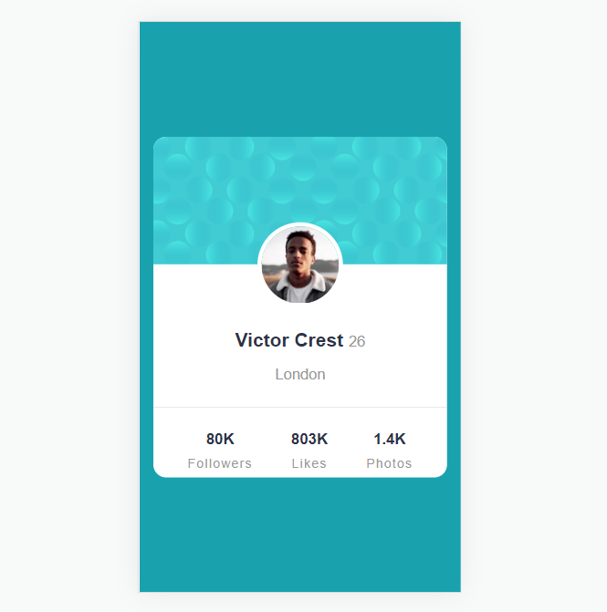

# Frontend Mentor - QR code component solution

This is a solution to the [QR code component challenge on Frontend Mentor](https://www.frontendmentor.io/challenges/qr-code-component-iux_sIO_H). Frontend Mentor challenges help you improve your coding skills by building realistic projects.

## Table of contents

- [Overview](#overview)
  - [Screenshot](#screenshot)
  - [Links](#links)
- [My process](#my-process)
  - [Built with](#built-with)
  - [What I learned](#what-i-learned)
  - [Useful resources](#useful-resources)
- [Author](#author)

## Overview

### Screenshot




### Links

- Solution URL: [Solution URL here](https://github.com/Luis0lo/Frontend-mentor-challanges/tree/main/profile-card-component-main)
- Live Site URL: [Live site URL here](https://luis0lo.github.io/Frontend-mentor-challanges/)

## My process

### Built with

- Semantic HTML5 markup
- CSS custom properties
- Mobile-first workflow

### What I learned

- Center containers horizontally and vertically using flex-box.
- Parent container will hold the next style:

```css
.main {
  min-height: 100vh;
  display: flex;
  justify-content: center;
  align-items: center;
}
```

### Useful resources

- [Center](https://www.w3schools.com/css/css3_flexbox_container.asp#:~:text=Try%20it%20Yourself%20%C2%BB-,Perfect%20Centering,-In%20the%20following) - This helped me to center the main container vertically and horinzontally using flex.

## Authors

- Website - [Luis Rodrigues](https://www.linkedin.com/in/withluis/)
- Frontend Mentor - [@Luis0lo](https://www.frontendmentor.io/profile/Luis0lo)
- Twitter - [@withluis1](https://twitter.com/withluis1)
